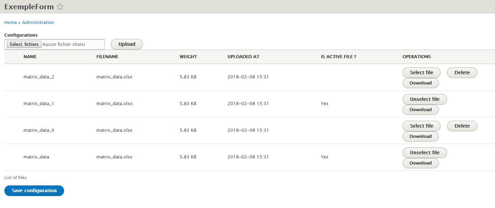

# Keep history of my custom uploaded files

## 1. Purpose

File_history offer a new form_api field type permiting :
- The upload of a file in a specific folder
- A validation between the serveur upload and drupal saving of file
- The list all files uploaded in this folder
- The activation of a specific file in this collection

The use case at the origin of this field are a tree like decision tool.
This tree are manage by a huge matrix datafile, and webmaster need to be 
available to update the data pool.
The memory of old uploaded files came to avaoid loosing a good data pool 
by the upload of a malformed matrix data file.

A full implementation exemple form are present in src/Form folder 
( web path : /admin/file_history/exemple_form ).

## 2. Implementation

The field use is similar than managed_file field

```
$form['configurations_files'] = [
        '#type' => 'file_history',
        '#title' => $this->t('Configurations'),
        '#description' => $this->t('List of files'),
        '#size' => 50,
        
        // Like Managed Files, general file validation.
        '#upload_validators' => $validators,
        // Folder to store files.
        '#upload_location' => 'public://my_configuration/',
        
        // If you need validation content of files before store it.
        '#content_validator' => [
          $class, 'myContentValidator',
        ],
```

The ``upload_location`` item are mandatory, please choose it wisely 
to avoid mixing files from another source.
We don't make any save of the list of uploaded files, 
just parse the upload_location folder.
This choice permit in a futur version to use files comming from automatic 
server source (copy from external source by a shell script).

The ``content_validator`` item permit to defined a specific validator method.
This static method will call between the server loading file (go to /tmp) 
and the Drupal saving it as file ( with fid).
The goal are to permit a specific and hard content control of data upload 
before the file saving.

## 3. Content validator

``` 
public static function myContentValidator(array $file_data = []) {
        /*
         * $file_data = [
         *   'file_original_name' => string
         *   'file_original_extension' => string
         *   'file_size' => integer
         *   'file_path' => string(14) ( like /tmp/XXXX )
         */
        // Deepest file validation.
        /*
         * Return value = [
         *  'status' => Boolean ( True => ok , False => error)
         *  'message' => string ( message to user )
         * ]
         */
        $status = TRUE;
        $message = 'OK';
        return ['status' => $status, 'message' => $message];
      }
```

As write before, this method are call between the server upload and the 
drupal management.
The parameter is an array with informations of file ( original name, 
extension, size), and the actual path of the file.
The return must contain at least the status. 
This status tell if the file can be send to drupal management to save it.


## 4. Visual



The field visual are composed in one part with a upload field and a submit.
The second part are a table listing all file already load in 
``upload_location``.
Each file have operations. 
The chosen file make be reload, this call a Controler which behavior will 
be alterable soon, permitting manipulation of file.
A non chosen make be choose or deleted.

On the form submit action, the field value is a array with state of the two
 html fields (upload and button) plus the value of the chosen file in the 
 'selected_file' attribut. 
 
 See a exemple of implementation below.
``` 
  public function submitForm(array &$form, FormStateInterface $form_state) {
    parent::submitForm($form, $form_state);

    $value = $form_state->getValue('configurations_files');
    
    // Do something on submit.
    
    $this->config('exemple_file_history.default')
      ->set('selected_configuration_file', $value['selected_file'])
      ->save();
  }
```

## 5. Further developments

- Cleaning code originaly from managed_file
- Add a real action to "reload" callback
- Add a manage of files add in work folder by external source (shell script)
- Correct issues...
- Something else ?
